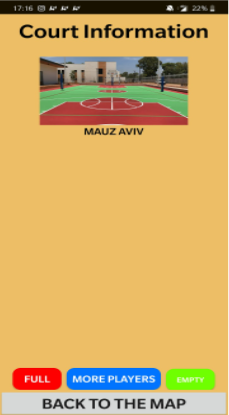

# SportIsrael

## Why I did this project
In 2020, I participated in the start up Israel contest.
I wanted to carry out my idea and build an app that would support it.
I knew Java and wanted to test my skills.

## More details
The app is wrriten in Java and the UI written in xml.
I used google's api to create maps.
I used FireBase (platform developed by google that offers free data-base serviece) for the app data-bases.

## Screenshots from the app

